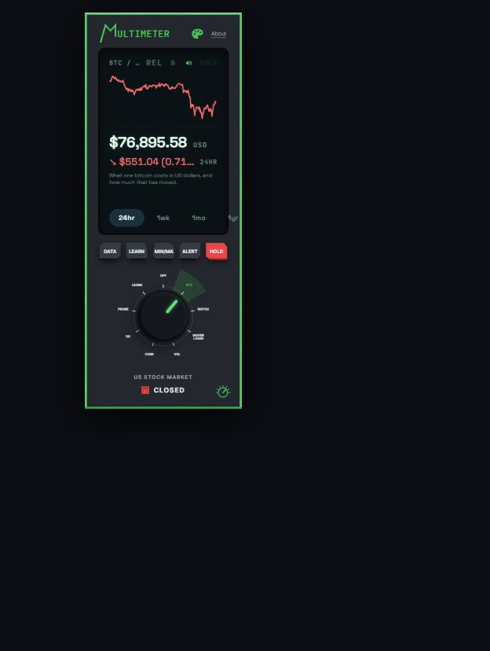

# Multimeter

[Open Multimeter](https://www.multimtr.com/)

I'm Jack McMurry, a student at Emory. I'm building Multimeter to make market concepts easier to explore through a more hands-on instrument.

Multimeter is a financial learning tool with a rotary dial. Choose a stock or cryptocurrency to explore its price history and risk measures. LEARN explains the measurement on screen.

## My process

I developed Multimeter with help from Claude Code and Codex. My next step is student testing.

## Current limitations

This is a prototype. Stock data uses published snapshots and may be delayed. Nothing here is investment advice.

CORR means correlation between assets; DD means drawdown from a peak.
