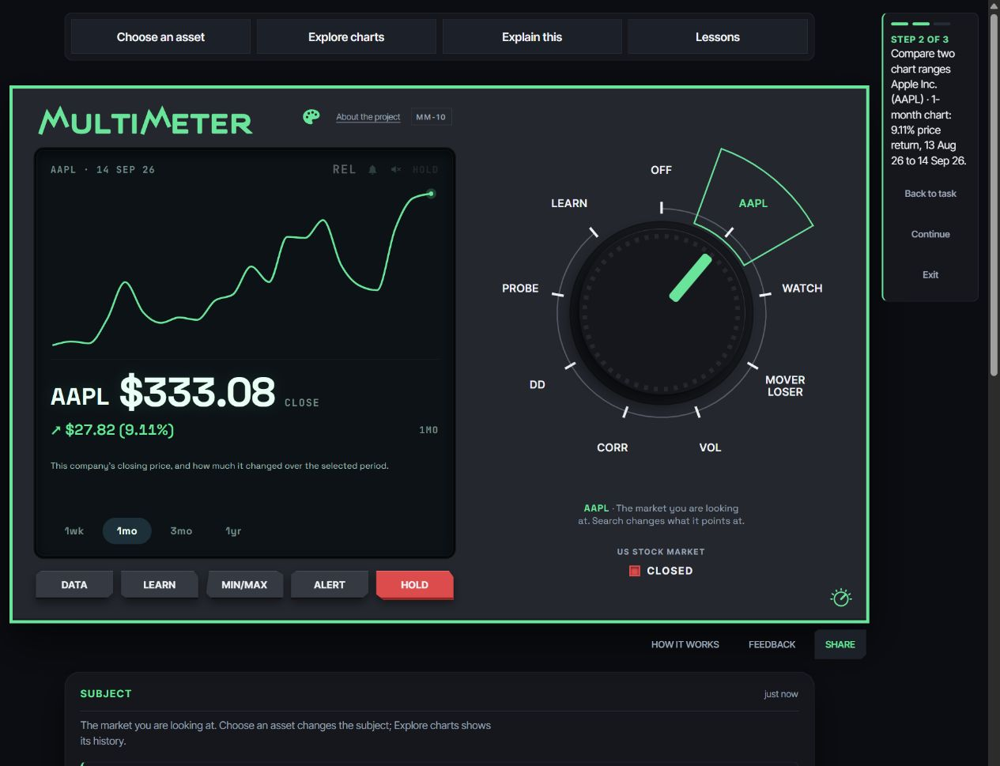
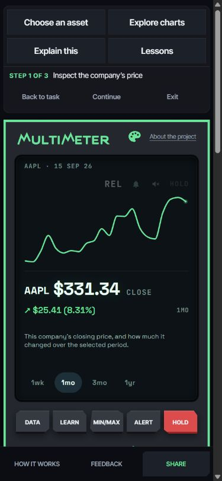

# Multimeter

[multimtr.com](https://www.multimtr.com/)

A financial instrument for learning how markets move. Turn the dial to a stock or cryptocurrency, measure its volatility, correlation or drawdown, and press LEARN to understand the number on screen.

Build a hypothetical stock mix in **WATCH → INFO → Practice portfolio**, or try **LEARN → INFO → Guided lessons**. Read the [practice portfolio and lessons guide](docs/learning.md).

> [!IMPORTANT]
> **Multimeter is in beta and is a prototype.** Stock data comes from published snapshots and may be delayed.

> [!NOTE]
> **CORR** means correlation, how closely two things move together. **DD** means drawdown, how far something has fallen from its peak.

> [!CAUTION]
> **Nothing here is investment advice.** Multimeter explains measurements. It does not tell you what to buy, sell or hold.

<table>
  <tr>
    <td align="center" valign="top">
      
    </td>
    <td align="center" valign="top">
      
    </td>
  </tr>
</table>

## About

I'm Jack McMurry, a student at Emory. I built Multimeter with Claude Code and Codex to make market concepts easier to explore through something hands-on. My next step is student testing.

**Fun fact:** Our signature green has a name: **Meter Mint** (#2EE59D).
