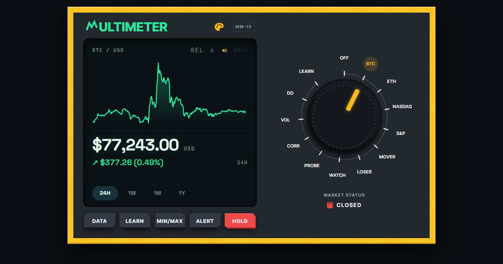

# Multimeter

A financial instrument for exploring how markets move.

I'm Jack McMurry, a finance student at Emory building Multimeter. Students select an asset and turn a physical-style dial to examine its price movement, volatility, drawdown, and relationships with other assets. Contextual LEARN explanations connect financial concepts to the measurements on screen.

I'm developing PROBE as an investigation layer grounded in those measurements. Its purpose is to help students ask better questions while distinguishing what market data shows from what it cannot explain.

My next step is to test the prototype with students, identify where they struggle, and measure whether exploration improves their understanding.

## Prototype status

The development version uses a nine-position dial: OFF, the active SUBJECT, WATCH, MOVER, VOL, CORR, DD, PROBE, and LEARN. DATA opens asset search inside the display. MOVER includes gainers and decliners. The subject follows the student between tools.

PROBE currently uses a local evidence engine. A separate Claude server implementation is in development; interactive Claude investigations are not yet verified as deployed. Available market data depends on provider coverage. Missing history must remain an explicit unavailable state.

The public site and this development branch may differ until the release is published and checked. The technical documentation below predates some of these changes and still needs reconciliation.

## Release plan

1. Review the outstanding changes, update the remaining documentation, and publish the same version we test.
2. Verify this path using production data: intro, search NVIDIA, price history, VOL, LEARN, correlation with the S&P 500, WATCH, and reopen NVIDIA. Check MOVER and DECLINERS too. Asset, graph, period, and timestamp must agree.
3. Before enabling public Claude requests, finish server wiring, input validation, rate limits, spending controls, and evidence provenance checks. Keep the rest of the instrument usable when PROBE is unavailable.
4. Run five student sessions. Observe without giving a tour after the intro. Fix the points where students cannot proceed or misinterpret a measurement.
5. Prepare a working URL, an accurate README, and an optional 60–90 second walkthrough for external reviewers. State limitations plainly.

## First student test

Ask each student to find an asset, explain its movement, inspect volatility, and explain correlation. Then ask what they want to investigate next.

Record whether they complete the tasks without help, correctly explain two concepts, choose another investigation, and voluntarily return within a week. Existing usage counters stay in the browser; they do not provide centralized retention reporting. Use observation and a short follow-up for this first test.

## Next steps

Use student feedback to improve the core flow, then test a bounded Claude integration and run one small campus workshop. Expand to another campus after students at Emory demonstrate a reason to return.

Accounts, portfolios, predictions, social features, and additional dial functions are outside this release. The next evidence we need is whether students learn through exploration and choose to use the instrument again.

**Live:** https://jackmcmurry.github.io/multimeter/



Built by Jack McMurry with Claude Code.

## What's on it

The page is one handheld multimeter. The rotary dial picks a function and
the screen shows that one reading: a tall chart, the price beneath it, the
change, and a row of tabs: the chart's range for the coins, a Stocks | Crypto
switch for MOVER and LOSER, and a stepper for WATCH. The DATA key, or a press on the
screen, opens a drawer beneath the meter with the charts and tables behind
the number. HOLD freezes the display. Two square lamps beneath the dial
show the US session: ON while the market is open, OFF when it is closed.

The palette beside the name opens the skins: gold (the default), blue,
pink, green, red, purple or silver. A skin recolours the holster and the
accents. The choice is stored in this browser (`mm.skin`) and applied before
the first paint.

On a wide window the meter lays out like a bench meter, screen on the left
and dial on the right. On a phone it stacks. Either way it is sized to fit
the window's height, so the screen and the dial are both in view.

| Dial | Screen reads | Drawer holds |
|---|---|---|
| OFF | blank | Method, sources, and the not-advice line |
| BTC | spot price in USD, change over the chosen range | the range chart in the printed style |
| ETH | spot price in USD, change over the chosen range | BTC, ETH, ^IXIC, ^GSPC (and QQQ with a key) as rows |
| NASDAQ | ^IXIC level, day change | the same rows |
| S&P | ^GSPC level, day change | the same rows |
| MOVER | the week's highest move: a badge, the ticker and the move, the price and day change, the rank | logo, price, 1d / 1m / market cap, the chart, and the week's board: the five highest and the five lowest |
| LOSER | the week's lowest move, the same way | the same panel, from the other end |
| WATCH | one of your stocks: its last close and the change over the chosen range | a search of the Nasdaq-100, and your list with close, date, 1d and 5d |
| PROBE | a coin of your choosing, change over the chosen range | coin search (CoinGecko), the pick, its range chart |
| CORR | coin–index 90-session correlation, 30-session change | pair selector, return scatter, rolling correlation, coupling table with beta and R² |
| VOL | the coin's 30-session realized vol, annualized | pair selector, current vols and the rolling column chart |
| DD | the coin's distance below its running peak | pair selector, underwater curves and the episode table |
| NOTE | the daily reading: three sentences in place of the chart, the session date as the value | the full reading, who wrote it, and the exact figures it was given |

MOVER and LOSER share a Stocks | Crypto switch in the tabs row, stored as
`mm.movers`. For stocks they rank the five-session moves of every Nasdaq-100
member the data job priced; for crypto, the seven-day moves of 15 large coins
other than bitcoin and ether. Both ends always appear together, and the
drawer says the ranking describes the past week and is not advice. WATCH
holds up to eight Nasdaq-100 stocks (`mm.watch`). It shows daily closes from
the data job, not live prices, because the page cannot call FMP. The old
`#stock` and `#crypto` links land on MOVER with the matching side of the
switch.

The statistics measure one coin against one index. The pair defaults to
bitcoin and the Nasdaq Composite; the selector at the top of those panels
offers BTC, ETH, the crypto mover and the probe coin against the Nasdaq
or the S&P 500 (stored as `mm.stats`). Bitcoin's daily closes come from the
data job; any other coin's come from its one-year CoinGecko chart, which the
1Y range tab shares. CoinGecko stamps each daily point at 00:00 UTC, which is
the close of the day before, so the page dates them that way to line up with
FMP's bars. The probe coin itself is stored as `mm.probe`.

The keys under the screen are the ones a real meter has. **REL** zeroes the
reading where it stands, so the change line shows the move since the press.
**MIN/MAX** captures the lowest and highest reading while it is on. **ALERT**
sets a level on the current stop; when the reading crosses it the meter beeps
three times, flashes, buzzes a phone and posts a notification if allowed, and
the bell on the screen lists armed and fired alerts. Alerts are kept in this
browser (`localStorage`, key `mm.alerts`) and evaluated only while the page
is open. **HOLD** freezes the display; MIN/MAX keeps capturing underneath.

Three things help a reader who is still learning the vocabulary. A line under
each drawer title says what the stop answers. A question mark beside a figure
opens what it measures and how this page computes it (`src/lib/concepts.js`).
A line at the foot of the drawer names the source and the window behind the
figures (`src/lib/context.js`). That same module builds MarketContext, one
structured account of the current stop: instrument, price with its basis and
source, change, history window, volatility, how unusual the last move was,
related pairs, market status and timestamps. Every field is either measured
or null. It is what a future explanation feature would be given, so that a
model writes over verified figures rather than recalling its own.

Usage counting is local (`src/lib/track.js`): a fixed list of event names,
counts in this browser, no third party, no network, no identifiers. FEEDBACK
in the drawer opens a note with three questions, which a tester can send with
those counts if they choose.

Routing is hash-based (`#corr`), so a stop is linkable and the back button
turns the dial. The old section hashes (`#home`, `#markets`, `#weekly`,
`#coupling`, `#beta`, `#volatility`, `#drawdown`, `#about`) and the tickers
`#ixic`, `#gspc`, `#qqq` still resolve.

The knob turns by dragging, by tapping a label, by tapping the knob itself
(one stop clockwise), by rolling the wheel over it, or with the arrow keys once it has focus. While dragging it follows the pointer and clicks at each detent.

## Findings: is bitcoin a tech stock?

The statistics feed a write-up at `findings.html`. The data job computes a
findings object from the daily history after each session
(`src/lib/findings.js`, no API calls): correlation, beta and R² over 30, 90
and 252 sessions against the Nasdaq and the S&P; a rolling 90-session
correlation with regimes read off it (above 0.5 coupled, below 0.2
decoupled), the longest run of each, and the three largest 20-session falls;
volatility; drawdowns; and the share of sessions the two closed the same way.
It lands in `docs/data/findings.json`. The page's prose is written by hand
with every number as a slot filled from that file, so the text can never
disagree with the data, and a fixed template turns the figures into a few
sentences that add nothing the numbers do not say.

## The daily reading

Once per session, after the US close and the final quote read, the data job
writes three plain sentences describing the session's figures and publishes
them as `docs/data/note.json`; the meter shows them on the NOTE stop.

When the `ANTHROPIC_API_KEY` secret is set, Claude writes them: one
Messages API call (Claude Opus 5, low effort, with server-side refusal
fallbacks) through the official SDK in `scripts/update-data.js`. The rules
are in the system prompt in `src/lib/note.js`: three sentences, at most 90
words, describe only the given figures, no predictions, recommendations or
advice, nothing added, and a closing not-advice line. The same file holds a
checker, `MP.note.validate`, that enforces those rules mechanically (banned
words, sentence and word counts, a cited figure, the closing line). A reply
that fails it is never published: a fixed template built from the numbers is,
the reason is recorded in `note.json`, and the job tries once more two hours
later. Without the key, the template is used every day, so a fork works with
no secret at all. Every note records the exact figures it was given, and the
drawer shows them.

Cost: one call per trading day plus at most one retry, a few hundred input
tokens each, which is a few dollars a year at Opus 5 rates.

## Install and share

The page is installable. On a phone, "Add to Home Screen" (or the install
prompt on Android Chrome) puts the yellow icon on the home screen and opens
the meter standalone. A small service worker (`docs/sw.js`, generated from
`src/sw.template.js`) precaches the shell and serves the page and the
`data/*.json` snapshots network-first with a cache fallback, so the meter
opens offline with the last figures it saw. It never touches CoinGecko,
Coinbase or the fonts. The cache name carries the build hash that
`build.ps1` prints, so a new build replaces the old cache on the next load.
Icons are rendered by `tools/icons.ps1` (System.Drawing) into `docs/icons`
and committed; rerun it only when the art changes.

**SHARE**, in the drawer's header, draws the screen's reading (mode, chart,
price and change) as a 1200×630 picture. It opens the system share sheet
where there is one, otherwise copies the picture to the clipboard, otherwise
downloads it.

## How it gets data

The page is static: one HTML file on GitHub Pages. Numbers reach it two ways.

**Crypto, live, from your browser.** CoinGecko's public API needs no key and
allows cross-origin requests, so the page polls it directly every 45 seconds
for bitcoin, ether, the probe coin and both crypto movers in one call, and
fetches the BTC chart per range.

**Ticks, from Coinbase.** Coinbase Exchange's public WebSocket feed streams
BTC-USD, ETH-USD, the probe coin and, while the switch is on crypto, the two
crypto movers, each when Coinbase lists it. While a
tick is under a minute old the screen paints Coinbase's last
trade; when the feed is quiet or blocked the polled CoinGecko price takes
over. The two sources differ by a few dollars, which is why the price can
step when the feed goes quiet. One subscription per product, so a coin Coinbase
does not carry fails alone. The drawer's rows always follow the poll.

**Everything else, from snapshot files.** Financial Modeling Prep and Alpha
Vantage require API keys, and a key in a public page is a leaked key. So a
scheduled GitHub Action (`.github/workflows/site.yml`) runs
`scripts/update-data.js` with the keys held as repository secrets, writes plain
JSON to `docs/data/`, commits it, and redeploys the site. The page reads those
files once a minute.

| Snapshot | Holds | Refreshed |
|---|---|---|
| `quotes.json` | ^IXIC, ^GSPC and the two stock movers (FMP), QQQ (Alpha Vantage) | every 15 min while the market is open (the movers every 30), then once after the close |
| `history.json` | ^IXIC, ^GSPC and BTCUSD daily closes (FMP), QQQ daily closes (Alpha Vantage) | once per session, an hour after the close |
| `stocks.json` | every Nasdaq-100 member's last close with its 1-day, 5-day and 1-month change, and the coverage count | after each close, as the members come in |
| `stocks/SYM.json` | one member's daily closes, up to 300 sessions | a third of the members per run after each close |
| `job.json` | the data job's ledger: when each member was fetched, and plan denials | whenever the members step runs |
| `spotlight.json` | the week's movers: the stock mover and loser from `stocks.json`, the crypto ones from one CoinGecko scan, the five at each end, twelve weeks of history. Version 2; it still writes the old single-pick fields for pages built before it | once a week, when a pass over the members is complete |
| `findings.json` | the write-up's statistics, computed from `history.json` | whenever history is rewritten |
| `note.json` | the daily reading, its source (Claude or the template) and the figures it was given | once per session, after the close |

Each run of the job works out for itself what is due (`src/lib/pipeline.js`),
so a late or skipped cron tick heals on the next one. On the free plans it
uses about 190 of FMP's 250 daily calls (the index quotes, the movers' quotes,
three history calls, and one call per Nasdaq-100 member, at most 35 a run),
10 of Alpha Vantage's 25, and one keyless CoinGecko call a week.

The market-open dot is computed in the browser from NYSE hours and a holiday
table (`src/lib/session.js`), with no API call.

### Plan limits worth knowing

- **QQQ** is not available on FMP's free plan (`ACCESS DENIED`), which is why
  it comes from Alpha Vantage. Alpha Vantage is optional: without its key the
  QQQ row and the "vs QQQ" coupling rows simply don't appear.
- **^NDX** needs a paid FMP plan; QQQ stands in for it, and the page says so.
- **Nasdaq-100 coverage.** FMP's free plan denies some members' daily closes;
  AVGO is one. The job parks each denial for 35 days in `job.json`, counts it
  in `stocks.json`, and ranks the movers among the members it could price.
  Each run's log prints the coverage, for example
  `universe: 35 fetched this run; 70 of 102 priced for 2026-09-11, 1 not on this plan`.
- **The member list** is fixed in `src/lib/universe.js` and dated. The job
  warns once it is more than 120 days old.

## Setup

1. **Secrets.** In the repository: Settings → Secrets and variables → Actions →
   New repository secret.
   - `FMP_API_KEY`: required. Free at financialmodelingprep.com.
   - `ALPHAVANTAGE_API_KEY`: optional, for QQQ. Free at alphavantage.co.
   - `ANTHROPIC_API_KEY`: optional, lets Claude write the daily reading
     (console.anthropic.com). Without it the reading comes from a template.
2. **Pages.** Settings → Pages → Build and deployment → Source: **GitHub
   Actions**.
3. **First run.** Actions → Site → Run workflow (force: `all`). That fills
   every snapshot and deploys. Then run it once more with force `universe`,
   which prices every Nasdaq-100 member in one run instead of three and
   prints the coverage. After that the schedule takes over.

A run whose data step fails still deploys the site; the failure shows as a
warning or error in the run summary. Keys never appear in logs: every URL is
passed through `MP.pipeline.redact` before it is printed.

## Local development

There is no Node on the development machine, so the build is PowerShell and the
tests run in a browser.

```powershell
.\build.ps1                          # docs/index.html + dist/multimeter.debug.html
.\tools\serve.ps1                    # serves dist/ at http://127.0.0.1:8787/
```

Then, in the debug page's console:

```js
MP.test.run()                        // statistics, the movers rule, router, dial labels, watch list
MP.dataTest.run()                    // session clock and every payload normalizer
await MP.dataTest.runPipeline()      // the data job against canned payloads
MP.app.stop(); MP.debug.renderSynthetic(7, 365)  // seeded walk through the real render path
var stop = MP.debug.cycle(1200); stop()          // tour every dial stop, then halt the tour
```

The pipeline suite replays a full Monday: pre-market first run, a pass over
the Nasdaq-100 in three runs, the movers, the hourly QQQ throttle, the final
read after the close, the history grace, a late daily bar, a split, FMP's
daily limit, the old spotlight file's migration, a missing key, FMP down, and
an Alpha Vantage rate limit.

The build refuses to ship if an inject marker survives, if debug or data-job
code leaks into the published page, if the page contains an `apikey=`
parameter, or if any `var(--token)` does not resolve against `styles.css`.

## Repository layout

```
.github/workflows/site.yml   schedule + deploy
scripts/update-data.js       data job entry point (Node 20, I/O only)
package.json                 the data job's one dependency (Anthropic SDK)
src/
  index.template.html        page shell with two @inject markers
  findings.template.html     the write-up, with data-f slots for the numbers
  styles.css                 the meter body, display, dial and drawer; single theme; Neue Haas Grotesk outside the screen (Helvetica Neue, then Inter Tight, where it is not installed), Space Grotesk and JetBrains Mono on it
  lib/
    stats.js                 statistics (pure)
    format.js                display formatting
    geom.js                  SVG chart kit
    findings.js              the write-up's statistics and narrative (pure)
    findings-page.js         fills findings.html from findings.json
    note.js                  the daily reading's prompt, checker and fallback (data job)
    universe.js              the Nasdaq-100 list and the rules for keeping its closes (data job)
    sources.js               endpoints + payload normalizers
    session.js               NYSE session clock
    store.js                 guarded localStorage (alerts, probe, statistics pair, skin, watch list, switch)
    router.js                hash routing between dial stops
    funcs.js                 REL and MIN/MAX
    alerts.js                alert levels and their evaluation
    meter.js                 the dial, the knob, the keys, and the screen paint
    live.js                  Coinbase WebSocket ticks
    share.js                 the share card
    watch.js                 the WATCH list and its search
    spotlight.js             MOVER and LOSER: the movers rule, the screen reading and the panel
    app.js                   state, polling, analytics, render
    pipeline.js              the data job's decisions (debug bundle + Node)
    debug.js                 synthetic-data render (debug bundle only)
test/
  stats.test.js
  data.test.js
tools/serve.ps1              loopback server for local checks
tools/icons.ps1              renders docs/icons/*.png from the icon art
docs/                        what GitHub Pages serves
  index.html                 built page (commit after .\build.ps1)
  findings.html              the built write-up
  sw.js                      service worker, stamped by the build
  manifest.webmanifest       web app manifest (copied from src/)
  icons/                     app icons
  data/*.json                snapshots (written by the Action)
  data/stocks/*.json         one file of daily closes per Nasdaq-100 member
```

## Method

- **Pairing.** Correlation and beta intersect the two series on dates each
  instrument actually traded *before* taking returns. Bitcoin trades weekends
  and the index does not, so without this step BTC's Monday return spans one
  day while the index's spans three.
- **Returns.** Log returns throughout: `r = ln(p_t / p_{t-1})`.
- **Beta.** `cov(btc, ixic) / var(ixic)`, BTC regressed on the index. It is
  the slope drawn through the return scatter, so chart and table agree.
- **Volatility.** Sample standard deviation of the 30-session window,
  annualized by √252.
- **Drawdown.** Computed on each instrument's own history. An episode opens
  when price falls below the running peak and closes when it regains it.
- **R² alongside beta.** A high beta with a low R² is a loose relationship.

## Maintenance

- **Holidays.** `src/lib/session.js` lists NYSE holidays through 2027. Add the
  next year's each December, then rebuild.
- **Nasdaq-100 members.** `src/lib/universe.js` holds the list as of its
  `AS_OF` date. Nasdaq rebalances each December; update the list then, or
  when the job warns that it is old.
- **Code changes.** Edit `src/`, run `.\build.ps1`, commit `docs/index.html`
  with the source. Pushing to `main` redeploys.

## Not financial advice

Market data for reference only. Nothing produced by this project is investment
advice, a recommendation, or a solicitation to trade. Figures are as reported by
the upstream sources and may be delayed, revised, or wrong.
